# Architecture — folder structure, classes, code flow, and design patterns

How the workflow execution engine is organized: package layout, main classes, request/runtime flows, and **which design patterns run at each step**.

**Stack:** FastAPI · SQLAlchemy 2.0 (sync) · PostgreSQL · Redis (readiness only)

Execution is **synchronous** in the request thread (no job queue).

> **Viewing diagrams:** open the Markdown **preview** (Cursor/VS Code: `Ctrl+Shift+V` / `Cmd+Shift+V`). Mermaid does not render in the raw editor. On GitHub, diagrams render on the file page automatically.

---

## Folder structure

```text
workflow-execution/
├── app/
│   ├── main.py                 # FastAPI app entry
│   ├── core/                   # config, logging, middleware, DI
│   ├── api/                    # HTTP edge
│   │   ├── routes/v1/          # View (path → controller)
│   │   ├── controllers/        # map schemas ↔ application
│   │   ├── schemas/v1/         # request/response Pydantic models
│   │   ├── deps.py / errors.py
│   ├── application/            # use-cases
│   │   ├── definitions/        # publish ingest
│   │   ├── executions/
│   │   │   ├── commands/       # start, submit, control
│   │   │   ├── queries/        # get/list/export
│   │   │   ├── graph_runtime.py
│   │   │   ├── auto_node_runner.py
│   │   │   └── service_factory.py
│   │   ├── events/             # event store + projection handlers
│   │   └── backups/
│   ├── domain/                 # pure rules + ports
│   │   ├── graph/ state/ validation/ definitions/ events/ seed/
│   │   └── ports/              # one Protocol file per port
│   ├── patterns/               # design-pattern kits only
│   │   ├── executions/
│   │   │   ├── strategies/     # BaseNodeExecutor, userInput, table
│   │   │   ├── factories/      # NodeExecutorRegistry
│   │   │   └── builders/       # instance + seed memento
│   │   ├── events/             # observer registry
│   │   └── backups/
│   └── infrastructure/
│       ├── persistence/        # models, repositories, UoW, seeds
│       ├── executions/         # projection readers
│       └── redis/ health/
├── alembic/                    # migrations
├── tests/                      # unit / integration / fixtures
├── docs/                       # this documentation set
├── docker-compose.yml
├── Makefile
└── requirements.txt
```

```mermaid
flowchart TB
  APP[app]
  APP --> API[api]
  APP --> APPLICATION[application]
  APP --> DOMAIN[domain]
  APP --> PATTERNS[patterns]
  APP --> INFRA[infrastructure]
  APP --> CORE[core]
  API --> routes
  API --> controllers
  API --> schemas
  APPLICATION --> definitions
  APPLICATION --> executions
  APPLICATION --> events
  APPLICATION --> backups
  executions --> commands
  executions --> queries
  DOMAIN --> graph
  DOMAIN --> state
  DOMAIN --> validation
  DOMAIN --> ports
  PATTERNS --> strategies
  PATTERNS --> factories
  PATTERNS --> builders
  INFRA --> persistence
  INFRA --> redis
  INFRA --> health
```

---

## Layer dependency rule

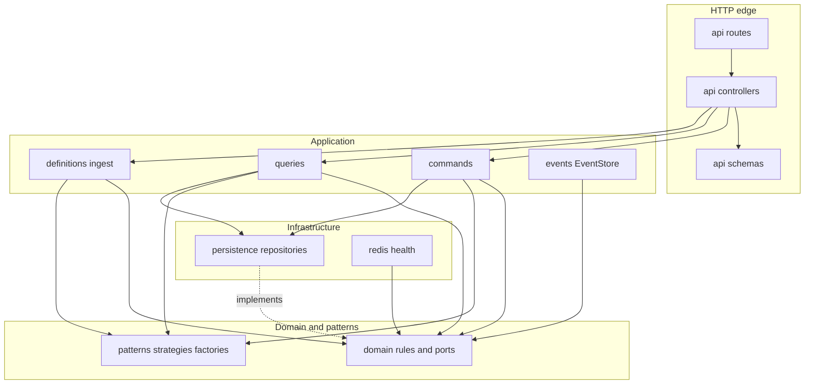

| Layer | May import | Must not import |
|-------|------------|-----------------|
| `domain` | stdlib | `api`, `application`, `infrastructure`, `patterns` |
| `patterns` | `domain` | `api`, application services, repositories |
| `application` | `domain`, `patterns` | FastAPI Request/Response in new code |
| `infrastructure` | `domain`, SQLAlchemy | `api` |
| `api` | `application`, schemas, `core` | `patterns`, repositories, ORM models |

Controllers never call repositories or `patterns/` directly. Commits happen in application services, not controllers.

---

## Class diagram (core collaborators)

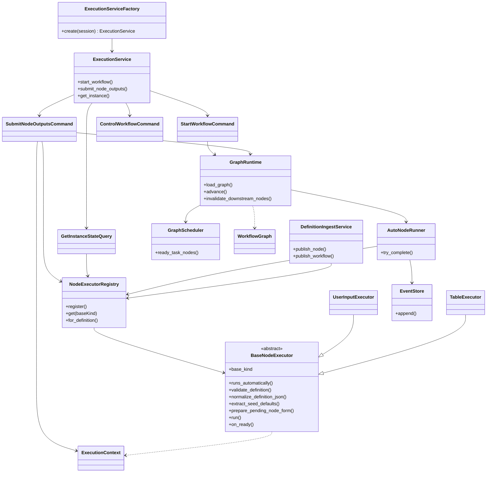

---

## Task-type polymorphism (registry dispatch)

Only the registry maps `baseKind` → strategy. Call sites never branch on kind strings.

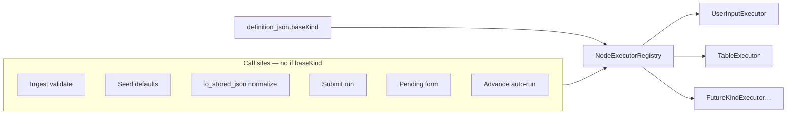

---

## Design patterns in code flow

Patterns are intentional. Kits live under `app/patterns/`; application use-cases **compose** them. Controllers stay thin (MVC edge).

### Pattern catalog

| Pattern | Role in this engine | Primary location |
|---------|---------------------|------------------|
| **Ports & Adapters (Hexagonal)** | Domain depends on Protocols; infra implements them | `domain/ports/` ← `infrastructure/persistence/` |
| **MVC (HTTP edge)** | Routes = View, Controllers = glue, Application = Model use-cases | `api/routes` → `api/controllers` → `application/` |
| **CQRS-style** | Writes in `commands/`, reads in `queries/` | `application/executions/commands|queries/` |
| **Facade** | Stable API for controllers | `ExecutionService` |
| **Abstract Factory / Composition Root** | Wire session → repos → commands/queries | `ExecutionServiceFactory` |
| **Factory Method + Registry** | `baseKind` → task strategy | `NodeExecutorRegistry` |
| **Strategy** | Per-kind validate / seed / execute / auto-run | `BaseNodeExecutor` subclasses |
| **Template Method** | Fixed `run()` skeleton: prepare → validate → complete | `BaseNodeExecutor.run` |
| **Builder** | Assemble instance + pinned nodes + graph | `WorkflowInstanceBuilder` |
| **Memento** | Capture prior static defaults for re-estimate | `SeedDefaultsMemento` (+ Builder) |
| **Observer** | Event append → dispatch projection handlers | `EventHandlerRegistry` + `EventStore` |
| **State (machine)** | Legal workflow status transitions | `WorkflowStateMachine` |
| **Repository** | Aggregate persistence behind ports | `*Repository` + `*RepositoryPort` |
| **Unit of Work** | Optional multi-repo transaction boundary | `UnitOfWork` |
| **Event Sourcing (lite)** | Append-only log is write SOFT; projections are reads | `EventStore` + handlers |

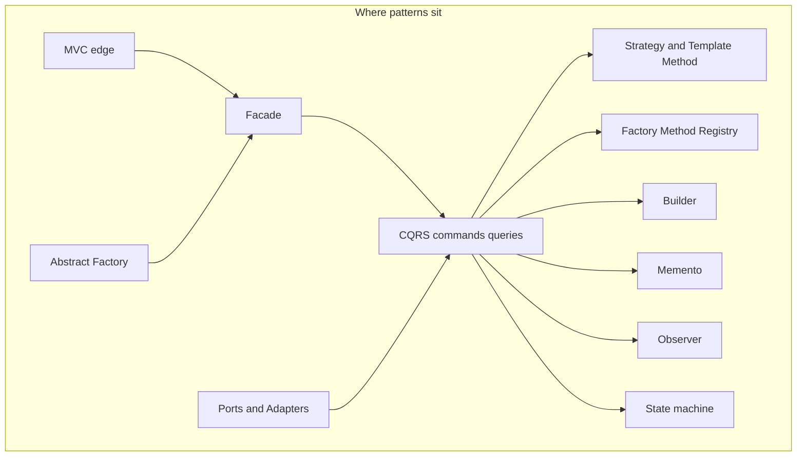

---

### End-to-end: which pattern fires when

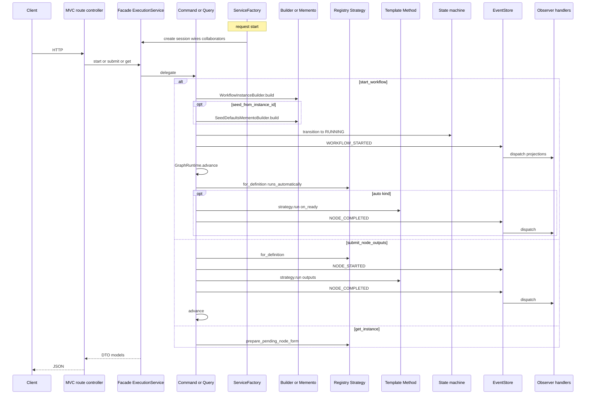

---

### 1. Ports & Adapters (Hexagonal)

**Intent:** Domain never imports SQLAlchemy or FastAPI. Application talks to **ports** (`Protocol`); infrastructure supplies **adapters**.

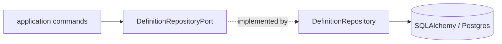

| Port | Adapter |
|------|---------|
| `DefinitionRepositoryPort` | `infrastructure/persistence/repositories/definitions.py` |
| `InstanceRepositoryPort` | `…/instances.py` |
| `EventRepositoryPort` | `…/events.py` |
| `ProjectionRepositoryPort` | `…/projections.py` |
| `NodeExecutor` | `patterns/executions/strategies/*` |
| `EventHandler` | `application/events/handlers/*` |

---

### 2. MVC at the HTTP edge

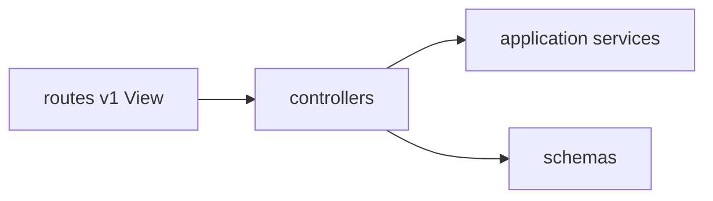

- Controllers map Pydantic ↔ application calls and **never** `session.commit()`.
- Routes only bind paths and call controllers.

---

### 3. CQRS-style + Facade

**Facade** — `ExecutionService` is the single entry for instance APIs.

**CQRS-style** — separate write and read collaborators (same DB; not two databases):

| Side | Classes |
|------|---------|
| Commands | `StartWorkflowCommand`, `SubmitNodeOutputsCommand`, `ControlWorkflowCommand` |
| Queries | `GetInstanceStateQuery`, `ListInstancesQuery`, `ExportInstancesQuery`, … |

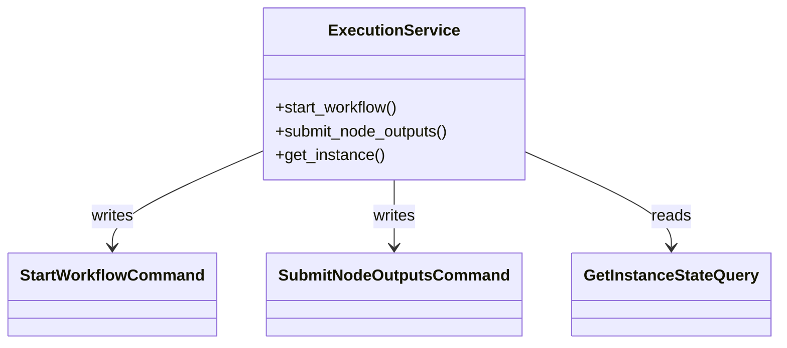

---

### 4. Abstract Factory (composition root)

`ExecutionServiceFactory.create(session)` builds the object graph once per request: repositories → `EventStore` + observer registry → executor registry → `AutoNodeRunner` → `GraphRuntime` → commands/queries → facade.

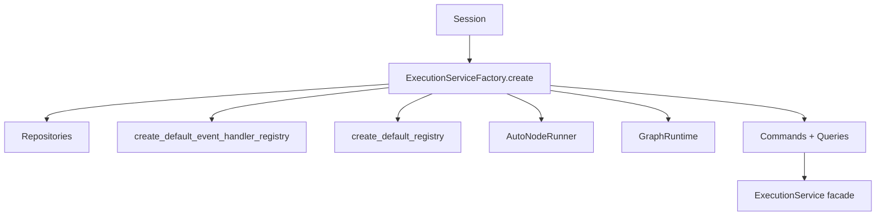

---

### 5. Factory Method + Registry + Strategy + Template Method

These four work together for every task kind.

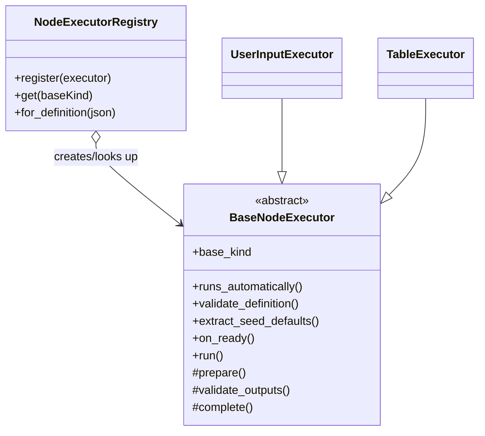

**Factory Method / Registry** — `create_default_registry()` registers strategies; `for_definition()` is the only place that reads `baseKind`.

**Strategy** — each subclass owns kind-specific validate, seed, form prep, cost, auto vs human.

**Template Method** — `run()` always:

```text
merged = prepare(context) ∪ outputs
validate_outputs(context, merged)
return complete(context, merged)
```

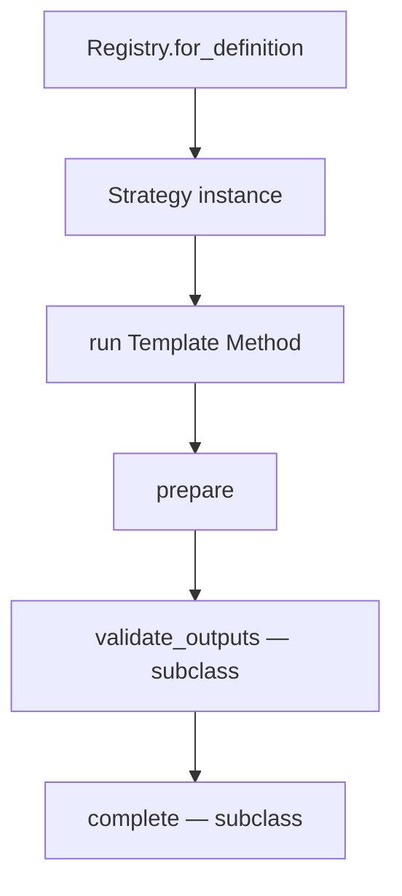

**Used in flow:**

| Step | Method on strategy |
|------|--------------------|
| Publish | `validate_definition`, `normalize_definition_json` |
| Seed revision | `extract_seed_defaults` |
| Pending UI | `prepare_pending_node_form` |
| Submit | `run` |
| Auto advance | `runs_automatically` + `on_ready` + `run` |

---

### 6. Builder

`WorkflowInstanceBuilder.build(...)` constructs a consistent aggregate: pin workflow version → create instance → create node instances (each pinned to a node definition version) → return `BuiltWorkflowInstance` (instance + graph + nodes).

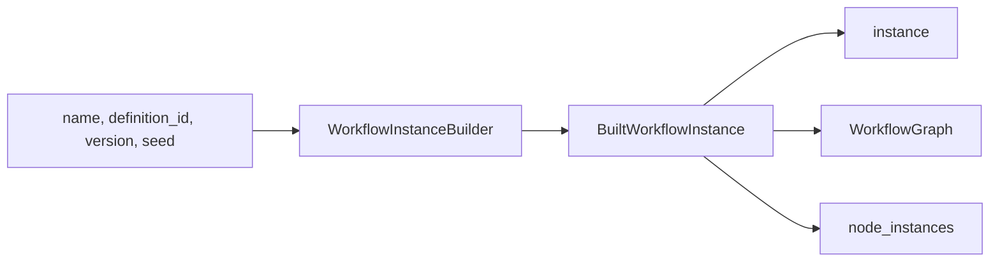

Called from `StartWorkflowCommand` before events and `advance`.

---

### 7. Memento

`SeedDefaultsMemento` stores opaque static defaults per graph node id (for re-estimate / seed-from-prior-run).

`SeedDefaultsMementoBuilder` restores that snapshot by reading completed executions and calling **strategy** `extract_seed_defaults` (no kind `if`s).

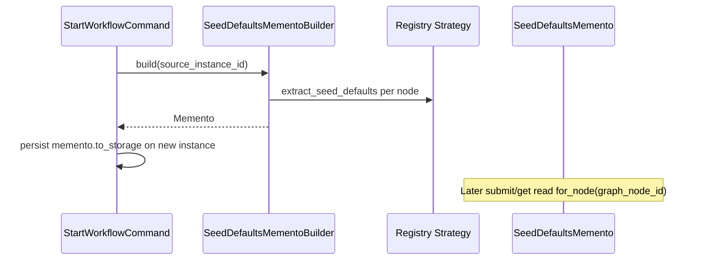

---

### 8. Observer (event handlers)

**Subject:** `EventStore.append`  
**Observers:** handlers registered on `EventHandlerRegistry` for event types.

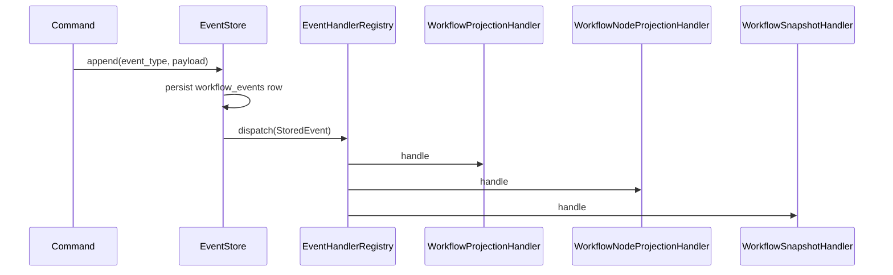

Wired in `create_default_event_handler_registry()`. Adding a projection = new handler + `register`, not changing commands.

---

### 9. State machine

`WorkflowStateMachine` encodes legal transitions; `GraphRuntime` / control commands call `transition` before updating status. Illegal moves raise `InvalidTransitionError`.

(See [Status state machines](#status-state-machines) below for diagrams.)

---

### 10. Repository + Unit of Work

Repositories encapsulate SQL. Application may use `UnitOfWork` when multiple repos must share one commit/rollback; the common request path commits via `ExecutionService._commit()` / ingest `_commit()` after the use-case succeeds.

---

### 11. Event sourcing (lite) + read models

Not full event-sourced aggregates with replay for every write — but:

1. **Append-only** `workflow_events` is the audit / projection source.
2. Handlers (Observer) update projections synchronously in the same request.
3. `ProjectionRebuilder` can replay the log to rebuild read models.

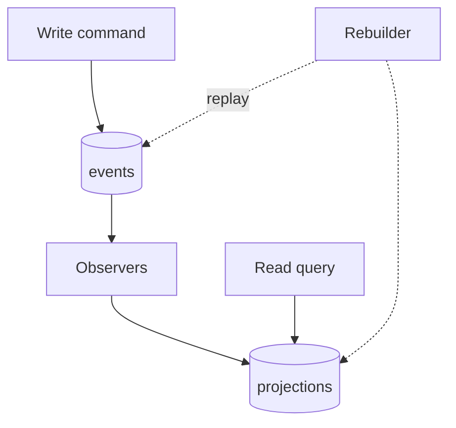

---

### Pattern → file cheat sheet

| Pattern | File(s) |
|---------|---------|
| Facade | `application/executions/service.py` |
| Abstract Factory | `application/executions/service_factory.py` |
| Commands / Queries | `application/executions/commands/*`, `queries/*` |
| Strategy + Template Method | `patterns/executions/strategies/base.py`, `user_input.py`, `table_input.py` |
| Factory Method Registry | `patterns/executions/factories/registry.py` |
| Builder | `patterns/executions/builders/instance_builder.py` |
| Memento | `patterns/executions/builders/seed_memento.py` |
| Observer registry | `patterns/events/observer_registry.py` |
| EventStore | `application/events/event_store.py` |
| State machine | `domain/state/workflow.py` |
| Ports | `domain/ports/*.py` |
| Repository adapters | `infrastructure/persistence/repositories/` |
| Unit of Work | `infrastructure/persistence/repositories/unit_of_work.py` |

---

## Status state machines

### Workflow instance

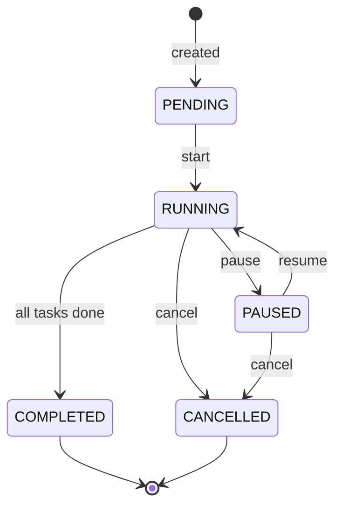

### Task node

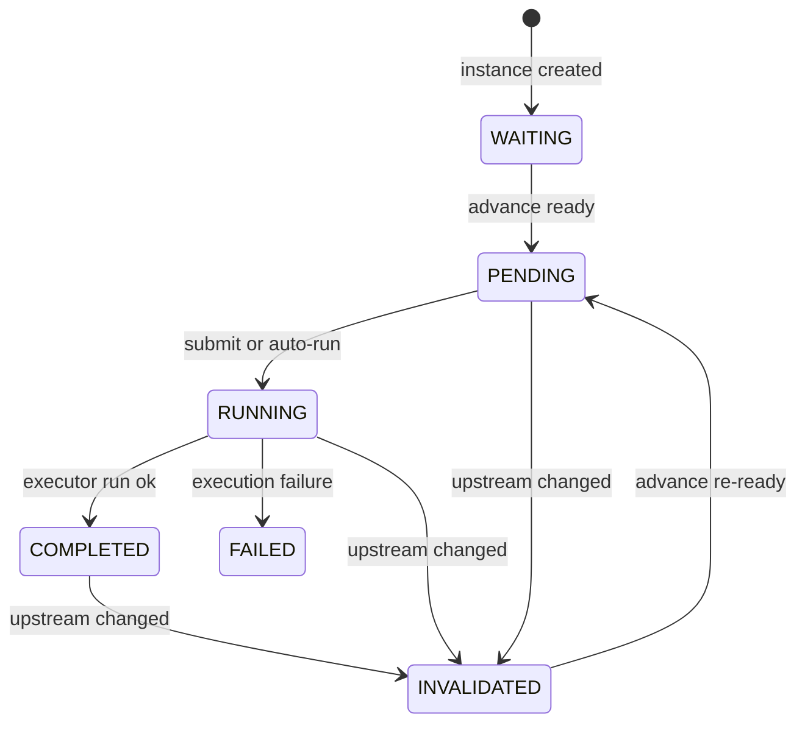

---

## Code flow — publish definition

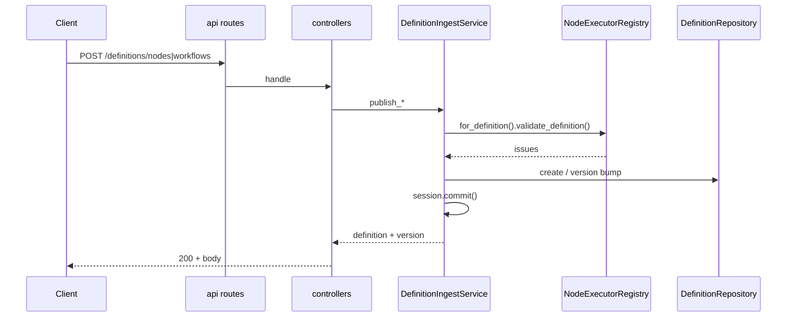

---

## Code flow — start instance and advance

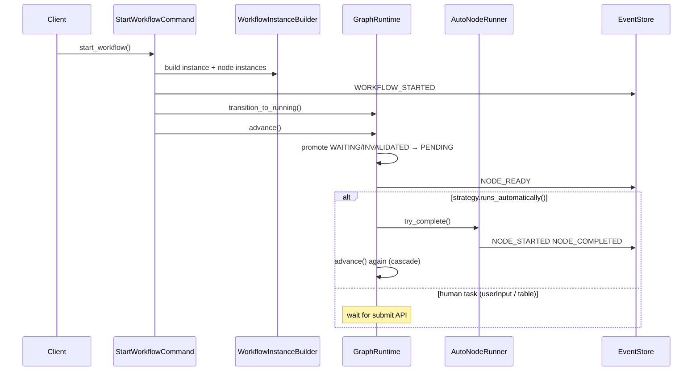

```mermaid
flowchart TD
    A[advance] --> B{workflow RUNNING?}
    B -->|no| Z[return]
    B -->|yes| C[GraphScheduler.ready_task_nodes]
    C --> D[Promote to PENDING + NODE_READY]
    D --> E{runs_automatically?}
    E -->|yes| F[AutoNodeRunner.try_complete]
    F --> G[NODE_STARTED / COMPLETED]
    G --> H{more auto work?}
    H -->|yes depth ok| A
    H -->|max depth| X[NodeExecutionError]
    E -->|no| I{all tasks COMPLETED?}
    I -->|yes| J[WORKFLOW_COMPLETED]
    I -->|no| Z
```

---

## Code flow — submit node outputs

```mermaid
sequenceDiagram
    participant Client
    participant Submit as SubmitNodeOutputsCommand
    participant Binder as GraphInputBinder
    participant Reg as NodeExecutorRegistry
    participant Exec as BaseNodeExecutor
    participant Events as EventStore
    participant Runtime as GraphRuntime

    Client->>Submit: submit_node_outputs(outputs)
    Submit->>Binder: resolve upstream inputs
    Submit->>Reg: for_definition(definition_json)
    Reg-->>Submit: strategy
    Submit->>Events: NODE_STARTED
    Submit->>Exec: run(context, outputs)
    Exec-->>Submit: final_outputs
    Submit->>Events: NODE_COMPLETED
    Submit->>Runtime: advance()
```

```mermaid
flowchart LR
    subgraph TemplateMethod["BaseNodeExecutor.run"]
        P[prepare] --> V[validate_outputs]
        V --> C[complete]
    end
    OUT[submitted outputs] --> P
    CTX[ExecutionContext] --> P
```

---

## Events → projections

```mermaid
flowchart LR
    CMD[Command writes] --> ES[EventStore.append]
    ES --> DB[(workflow_events)]
    ES --> H[Projection handlers]
    H --> WP[(workflow_projections)]
    H --> NP[(workflow_node_projections)]
    H --> SN[(workflow_snapshots)]
    QRY[Queries / API reads] --> WP
    QRY --> NP
```

---

## Demo workflow graph

Fixtures in `tests/fixtures/`:

```mermaid
flowchart LR
    S([start]) --> G[General Information userInput]
    G --> R[Raw Material Pricing userInput]
    R --> E([end])
```

---

## Where to change what

| Task | Start here |
|------|------------|
| Add API endpoint | `app/api/routes/v1/` + controller |
| Add request/response schema | `app/api/schemas/v1/` |
| Change write orchestration | `app/application/executions/commands/` |
| Change read models for API | `app/application/executions/queries/` |
| Add node type (`baseKind`) | `patterns/executions/strategies/` + register in `factories/registry.py` |
| Add validation rule | `app/domain/validation/` |
| Add event / projection handler | `domain/events/` + `application/events/handlers/` |
| Change DB schema | `infrastructure/persistence/models/` → Alembic → `make migrate` |
| Map domain error → HTTP | `app/api/errors.py` |

### Adding a node type

```mermaid
flowchart TD
    A[Subclass BaseNodeExecutor] --> B[Implement validate / normalize / seed / run]
    B --> C{Automatic?}
    C -->|yes| D[runs_automatically = True + on_ready]
    C -->|no| E[Human PENDING until submit]
    D --> F[Register in create_default_registry only]
    E --> F
    F --> G[Enable kind in base_types]
    G --> H[Unit + integration tests]
```

1. Subclass `BaseNodeExecutor` under `app/patterns/executions/strategies/`.
2. Implement `validate_definition`, normalize/seed helpers, prepare/run (and `on_ready` if automatic).
3. Set `runs_automatically()` when `GraphRuntime.advance` should execute without UI submit.
4. Register **only** in `create_default_registry()`.
5. Enable the kind in `base_types` if publish should accept it.

---

## Related docs

- [Database structure](DATABASE.md)
- [Development setup](DEVELOPMENT.md)
