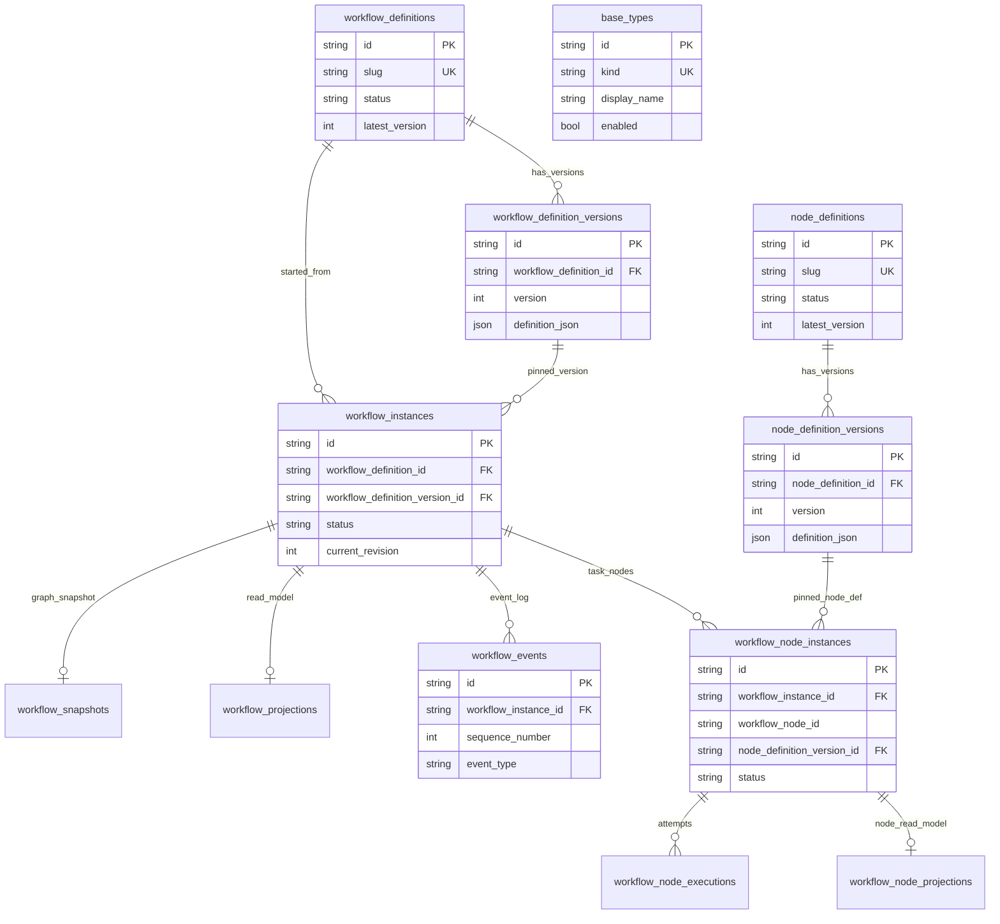
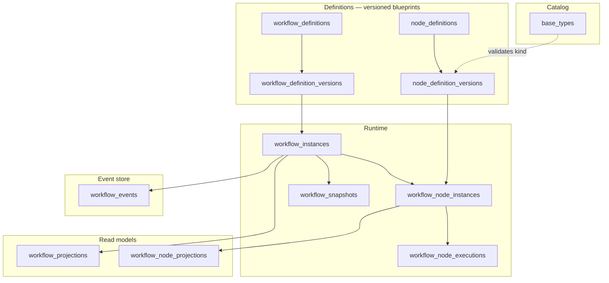
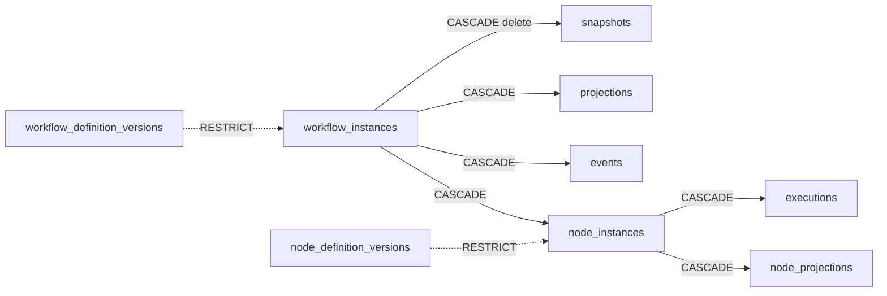
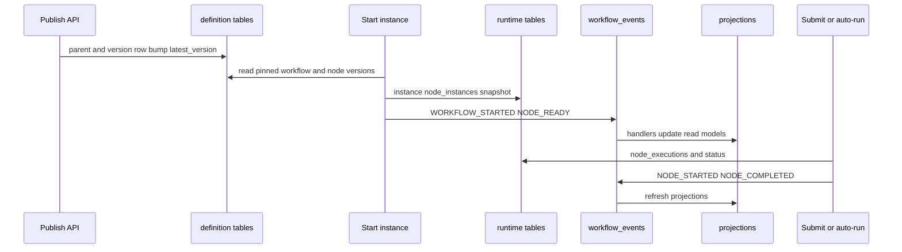
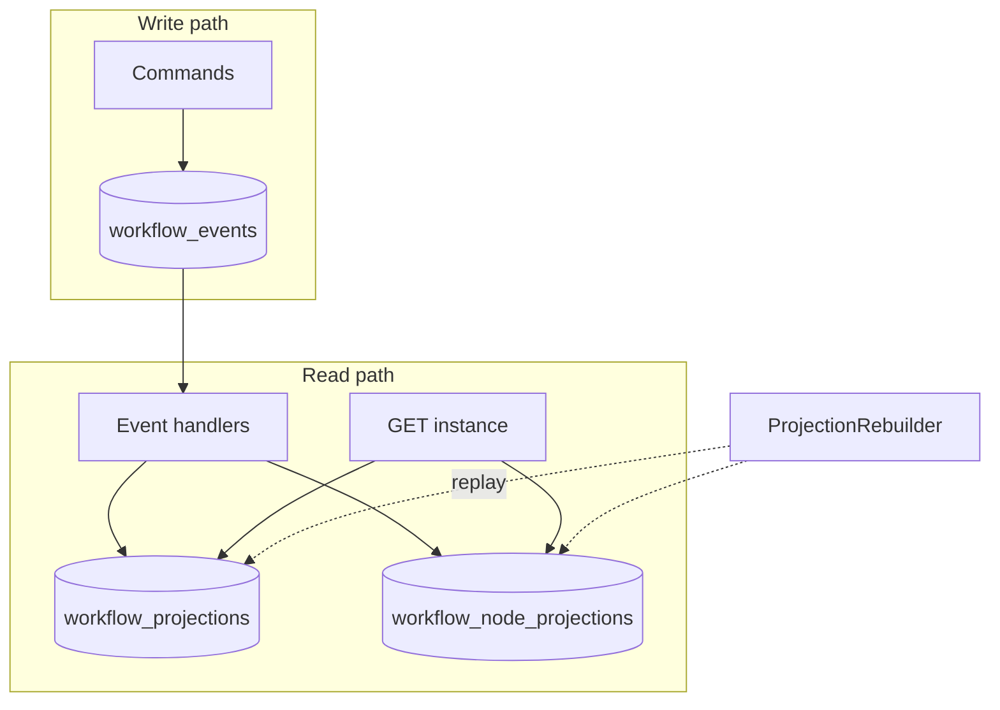
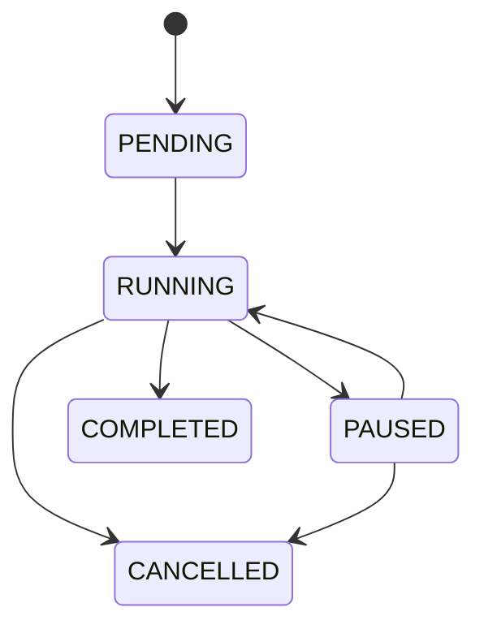
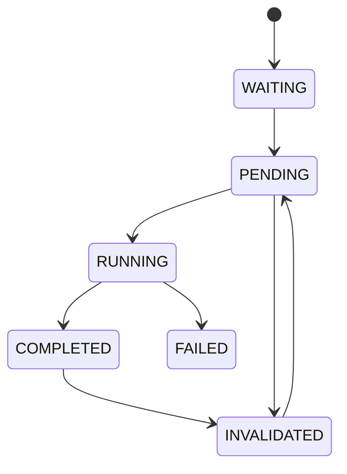

# Database structure

PostgreSQL schema for the workflow engine: **versioned definitions**, **runtime instances**, **append-only events**, and **read projections**.

- Models: `app/infrastructure/persistence/models/`
- Migrations: `alembic/versions/`

For local DB commands, see [Development setup](DEVELOPMENT.md).

> **Viewing diagrams:** open Markdown **preview** (`Ctrl+Shift+V` / `Cmd+Shift+V`). Mermaid is not shown in the raw editor.

---

## Entity-relationship diagram

---

## Logical layers

| Layer | Tables | Role |
|-------|--------|------|
| Catalog | `base_types` | Allowed node `baseKind` values (`userInput`, `table`, …) |
| Definitions | `node_definitions`, `node_definition_versions`, `workflow_definitions`, `workflow_definition_versions` | Immutable published blueprints (versioned JSON) |
| Runtime | `workflow_instances`, `workflow_node_instances`, `workflow_node_executions`, `workflow_snapshots` | Live execution state |
| Event store | `workflow_events` | Append-only history (`sequence_number` unique per instance) |
| Projections | `workflow_projections`, `workflow_node_projections` | Materialized read models for API/UI |

---

## Tables

### Catalog

#### `base_types`

| Column | Type | Notes |
|--------|------|--------|
| `id` | string PK | Stable catalog id |
| `kind` | string UK | e.g. `userInput`, `table` |
| `display_name` | string | UI label |
| `description` | string | |
| `enabled` | bool | Disabled kinds cannot be published |
| `version` | string | Catalog row version |

No FKs. Publish checks that a node’s `baseKind` exists and is enabled.

---

### Definitions

#### `node_definitions`

| Column | Type | Notes |
|--------|------|--------|
| `id` | string PK | Client-supplied or generated UUID |
| `name` | string | |
| `slug` | string UK | URL key |
| `status` | string | e.g. `draft`, `published` |
| `latest_version` | int | Pointer to newest version row |
| `created_at` / `updated_at` | timestamptz | |

**Relations:** 1 → N `node_definition_versions` (`ON DELETE CASCADE`).

#### `node_definition_versions`

| Column | Type | Notes |
|--------|------|--------|
| `id` | string PK | |
| `node_definition_id` | FK → `node_definitions` | CASCADE |
| `version` | int | Unique with `node_definition_id` |
| `definition_json` | JSON | Form/table schema, appearance, aggregations, … |
| `created_by` | string? | |
| `created_at` | timestamptz | |

**Relations:** referenced by `workflow_node_instances.node_definition_version_id` (no CASCADE — instances pin a version).

#### `workflow_definitions`

Same shape as node definitions (`id`, `name`, `slug`, `status`, `latest_version`, timestamps).

**Relations:** 1 → N `workflow_definition_versions` (CASCADE); 1 → N `workflow_instances`.

#### `workflow_definition_versions`

| Column | Type | Notes |
|--------|------|--------|
| `id` | string PK | |
| `workflow_definition_id` | FK → `workflow_definitions` | CASCADE |
| `version` | int | Unique with parent id |
| `definition_json` | JSON | Graph: `nodes`, `edges`, description |
| `created_by` / `created_at` | | |

**Relations:** 1 → N `workflow_instances` (pinned version).

---

### Runtime

#### `workflow_instances`

| Column | Type | Notes |
|--------|------|--------|
| `id` | string PK | |
| `name` | string | Run display name |
| `workflow_definition_id` | FK → `workflow_definitions` | Definition identity |
| `workflow_definition_version_id` | FK → `workflow_definition_versions` | Pinned graph version |
| `status` | enum `workflow_status` | `PENDING`, `RUNNING`, `PAUSED`, `COMPLETED`, `CANCELLED` |
| `current_revision` | int | Optimistic concurrency |
| `created_by` / `created_at` / `completed_at` | | |

**Relations:**

- N → 1 `workflow_definitions`, `workflow_definition_versions`
- 1 → 1 `workflow_snapshots` (CASCADE)
- 1 → 1 `workflow_projections` (CASCADE)
- 1 → N `workflow_events` (CASCADE)
- 1 → N `workflow_node_instances` (CASCADE)

#### `workflow_snapshots`

| Column | Type | Notes |
|--------|------|--------|
| `id` | string PK | |
| `workflow_instance_id` | FK UK → `workflow_instances` | CASCADE |
| `snapshot_json` | JSON | Frozen graph + metadata at start |
| `created_at` | timestamptz | |

#### `workflow_node_instances`

| Column | Type | Notes |
|--------|------|--------|
| `id` | string PK | |
| `workflow_instance_id` | FK → `workflow_instances` | CASCADE |
| `workflow_node_id` | string | Graph node id from definition JSON |
| `node_definition_version_id` | FK → `node_definition_versions` | Pinned task definition |
| `status` | enum `node_status` | `WAITING`, `PENDING`, `RUNNING`, `COMPLETED`, `INVALIDATED`, `FAILED` |
| `current_execution` | int | Latest execution number |
| `created_at` / `updated_at` | timestamptz | |

**Unique:** (`workflow_instance_id`, `workflow_node_id`).

**Relations:** 1 → N `workflow_node_executions` (CASCADE); 1 → 1 `workflow_node_projections` (CASCADE).

#### `workflow_node_executions`

| Column | Type | Notes |
|--------|------|--------|
| `id` | string PK | |
| `workflow_instance_id` | string | Denormalized instance id (not FK) |
| `workflow_node_instance_id` | FK → `workflow_node_instances` | CASCADE |
| `execution_number` | int | Unique with node instance |
| `inputs_json` / `outputs_json` | JSON | |
| `status` | enum `execution_status` | `RUNNING`, `COMPLETED`, `FAILED` |
| `executed_by` / `started_at` / `completed_at` | | |

---

### Event store

#### `workflow_events`

| Column | Type | Notes |
|--------|------|--------|
| `id` | string PK | |
| `workflow_instance_id` | FK → `workflow_instances` | CASCADE |
| `sequence_number` | int | Unique with instance (monotonic) |
| `event_type` | string | Domain event name |
| `payload_json` | JSON | |
| `previous_hash` / `current_hash` | string? | Optional hash chain |
| `created_by` / `created_at` | | |

**Index:** (`workflow_instance_id`, `created_at`).

---

### Projections (read models)

#### `workflow_projections`

| Column | Type | Notes |
|--------|------|--------|
| `id` | string PK | |
| `workflow_instance_id` | FK UK → `workflow_instances` | CASCADE |
| `current_state_json` | JSON | Aggregated instance view |
| `updated_at` | timestamptz | |

#### `workflow_node_projections`

| Column | Type | Notes |
|--------|------|--------|
| `id` | string PK | |
| `workflow_instance_id` | string | Denormalized (not FK) |
| `workflow_node_instance_id` | FK UK → `workflow_node_instances` | CASCADE |
| `current_values_json` | JSON | Current inputs/outputs for the node |
| `updated_at` | timestamptz | |

---

## Relationship summary

| From | To | Cardinality | On delete |
|------|----|-------------|-----------|
| `node_definitions` | `node_definition_versions` | 1:N | CASCADE |
| `workflow_definitions` | `workflow_definition_versions` | 1:N | CASCADE |
| `workflow_definitions` | `workflow_instances` | 1:N | restrict |
| `workflow_definition_versions` | `workflow_instances` | 1:N | restrict |
| `node_definition_versions` | `workflow_node_instances` | 1:N | restrict |
| `workflow_instances` | `workflow_snapshots` | 1:1 | CASCADE |
| `workflow_instances` | `workflow_projections` | 1:1 | CASCADE |
| `workflow_instances` | `workflow_events` | 1:N | CASCADE |
| `workflow_instances` | `workflow_node_instances` | 1:N | CASCADE |
| `workflow_node_instances` | `workflow_node_executions` | 1:N | CASCADE |
| `workflow_node_instances` | `workflow_node_projections` | 1:1 | CASCADE |

Definition version FKs on instances are **restrict** so published blueprints are not deleted while runs still reference them. Runtime children of an instance **cascade** when the instance is removed.

---

## Typical write flow

1. Publish **node** / **workflow** definitions → parent row + version row (`latest_version` bumped).
2. **Start instance** → pin a workflow definition version; create `workflow_node_instances` (each pins a `node_definition_version`); create snapshot + initial projection/events.
3. **Submit node** (or auto-complete) → append `workflow_events`; insert `workflow_node_executions`; update statuses and projections.

---

## Events vs projections

---

## Enums (PostgreSQL)

| Enum type | Values |
|-----------|--------|
| `workflow_status` | `PENDING`, `RUNNING`, `PAUSED`, `COMPLETED`, `CANCELLED` |
| `node_status` | `WAITING`, `PENDING`, `RUNNING`, `COMPLETED`, `INVALIDATED`, `FAILED` |
| `execution_status` | `RUNNING`, `COMPLETED`, `FAILED` |

---

## Related docs

- [Architecture](ARCHITECTURE.md)
- [Development setup](DEVELOPMENT.md)
