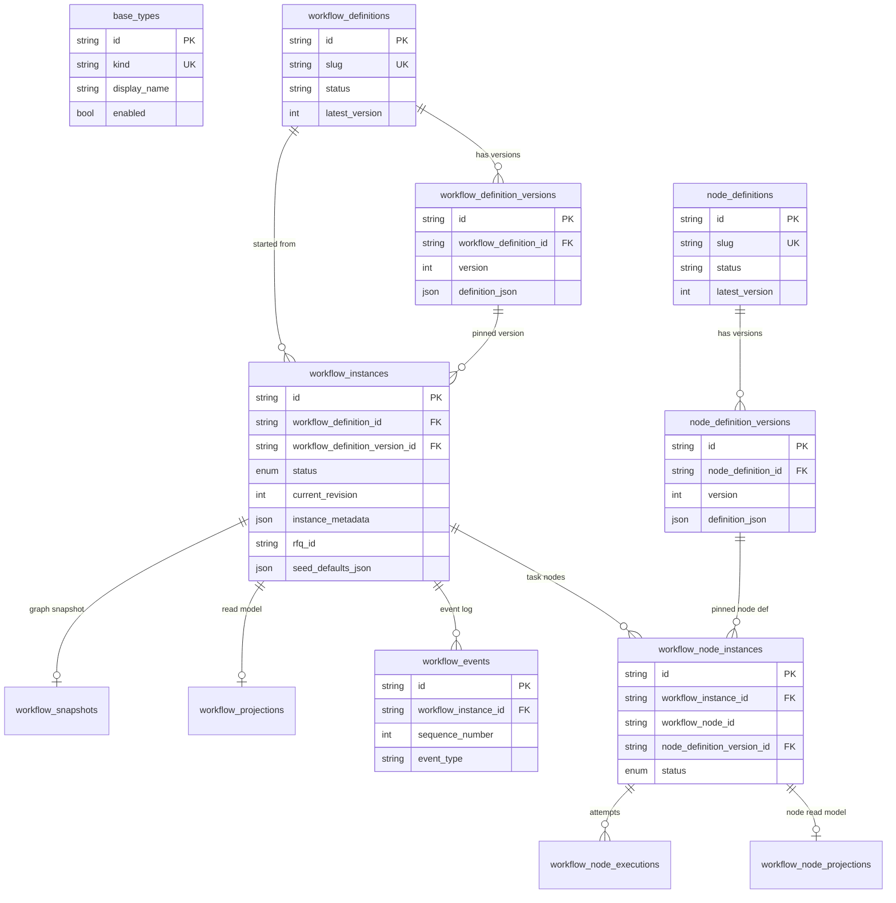

# Database structure and relations

PostgreSQL schema for the workflow engine: **versioned definitions**, **runtime instances**, **append-only events**, and **read projections**.

Models live under `app/infrastructure/db/models/`. Migrations are in `alembic/versions/`.

---

## Entity relationship overview



---

## Logical layers

| Layer | Tables | Role |
|-------|--------|------|
| Catalog | `base_types` | Allowed node `baseKind` values (`userInput`, `table`, …) |
| Definitions | `node_definitions`, `node_definition_versions`, `workflow_definitions`, `workflow_definition_versions` | Immutable published blueprints (versioned JSON) |
| Runtime | `workflow_instances`, `workflow_node_instances`, `workflow_node_executions`, `workflow_snapshots` | Live execution state |
| Event store | `workflow_events` | Append-only history (`sequence_number` unique per instance) |
| Projections | `workflow_projections`, `workflow_node_projections` | Materialized read models for API/UI |

---

## Tables

### Catalog

#### `base_types`

| Column | Type | Notes |
|--------|------|--------|
| `id` | string PK | Stable catalog id |
| `kind` | string UK | e.g. `userInput`, `table` |
| `display_name` | string | UI label |
| `description` | string | |
| `enabled` | bool | Disabled kinds cannot be published |
| `version` | string | Catalog row version |

No FKs. Publish flow checks that a node’s `baseKind` exists and is enabled. Seeded by migrations (`002`, `003`, `004`).

---

### Definitions

#### `node_definitions`

| Column | Type | Notes |
|--------|------|--------|
| `id` | string PK | Client-supplied or generated UUID |
| `name` | string | |
| `slug` | string UK | URL key |
| `status` | string | e.g. `draft`, `published` |
| `latest_version` | int | Pointer to newest version row |
| `created_at` / `updated_at` | timestamptz | |

**Relations:** 1 → N `node_definition_versions` (`ON DELETE CASCADE`).

#### `node_definition_versions`

| Column | Type | Notes |
|--------|------|--------|
| `id` | string PK | |
| `node_definition_id` | FK → `node_definitions` | CASCADE |
| `version` | int | Unique with `node_definition_id` |
| `definition_json` | JSON | Form/table schema, appearance, aggregations, … |
| `created_by` | string? | |
| `created_at` | timestamptz | |

**Relations:** N ← 1 `node_definitions`; referenced by `workflow_node_instances.node_definition_version_id` (no CASCADE — instances pin a version).

#### `workflow_definitions`

Same shape as node definitions (`id`, `name`, `slug`, `status`, `latest_version`, timestamps).

**Relations:** 1 → N `workflow_definition_versions` (CASCADE); 1 → N `workflow_instances`.

#### `workflow_definition_versions`

| Column | Type | Notes |
|--------|------|--------|
| `id` | string PK | |
| `workflow_definition_id` | FK → `workflow_definitions` | CASCADE |
| `version` | int | Unique with parent id |
| `definition_json` | JSON | Graph: `nodes`, `edges`, `metadataFields`, description |
| `created_by` / `created_at` | | |

**Relations:** N ← 1 `workflow_definitions`; 1 → N `workflow_instances` (pinned version).

---

### Runtime

#### `workflow_instances`

| Column | Type | Notes |
|--------|------|--------|
| `id` | string PK | |
| `name` | string | Run display name |
| `workflow_definition_id` | FK → `workflow_definitions` | Definition identity |
| `workflow_definition_version_id` | FK → `workflow_definition_versions` | Pinned graph version |
| `status` | enum `workflow_status` | `PENDING`, `RUNNING`, `PAUSED`, `COMPLETED`, `CANCELLED` |
| `current_revision` | int | Optimistic concurrency (starts at 1; incremented on status changes and some invalidations) |
| `instance_metadata` | JSON | Business metadata (`rfqId`, `estimateRevision`, `currentTotal`, custom keys) |
| `rfq_id` | string? | Denormalized from metadata for indexed RFQ listing |
| `seed_defaults_json` | JSON | Static field defaults keyed by graph node id (from `seed_from_instance_id` memento) |
| `created_by` / `created_at` / `completed_at` | | |

**Relations:**

- N → 1 `workflow_definitions`, `workflow_definition_versions`
- 1 → 1 `workflow_snapshots` (CASCADE)
- 1 → 1 `workflow_projections` (CASCADE)
- 1 → N `workflow_events` (CASCADE)
- 1 → N `workflow_node_instances` (CASCADE)

**Indexes:** `rfq_id` (migration `005`); additional list/search indexes via `006`.

#### `workflow_snapshots`

| Column | Type | Notes |
|--------|------|--------|
| `id` | string PK | |
| `workflow_instance_id` | FK UK → `workflow_instances` | CASCADE |
| `snapshot_json` | JSON | Frozen graph JSON at `WORKFLOW_STARTED` |
| `created_at` | timestamptz | |

Created by `WorkflowSnapshotHandler` on first `WORKFLOW_STARTED` event. `_load_graph()` prefers snapshot over live definition version.

#### `workflow_node_instances`

| Column | Type | Notes |
|--------|------|--------|
| `id` | string PK | |
| `workflow_instance_id` | FK → `workflow_instances` | CASCADE |
| `workflow_node_id` | string | Graph node id from definition JSON |
| `node_definition_version_id` | FK → `node_definition_versions` | Pinned task definition |
| `status` | enum `node_status` | See enums below |
| `current_execution` | int | Latest execution number (0 before first submit) |
| `created_at` / `updated_at` | timestamptz | |

**Unique:** (`workflow_instance_id`, `workflow_node_id`).

**Relations:** 1 → N `workflow_node_executions` (CASCADE); 1 → 1 `workflow_node_projections` (CASCADE).

#### `workflow_node_executions`

| Column | Type | Notes |
|--------|------|--------|
| `id` | string PK | |
| `workflow_instance_id` | string | Denormalized instance id (not FK) |
| `workflow_node_instance_id` | FK → `workflow_node_instances` | CASCADE |
| `execution_number` | int | Unique with node instance |
| `inputs_json` / `outputs_json` | JSON | Resolved inputs and final outputs |
| `status` | enum `execution_status` | `RUNNING`, `COMPLETED`, `FAILED` |
| `executed_by` / `started_at` / `completed_at` | | |

Each successful submit creates a new execution row and increments `current_execution` on the node instance. Reopen/resubmit creates additional execution history.

---

### Event store

#### `workflow_events`

| Column | Type | Notes |
|--------|------|--------|
| `id` | string PK | |
| `workflow_instance_id` | FK → `workflow_instances` | CASCADE |
| `sequence_number` | int | Unique with instance (monotonic per instance) |
| `event_type` | string | See event types below |
| `payload_json` | JSON | Event payload (may include full graph snapshot on start) |
| `previous_hash` / `current_hash` | string? | Optional hash chain when `EVENT_HASH_CHAIN=true` |
| `created_by` / `created_at` | | |

**Index:** (`workflow_instance_id`, `created_at`).

**Concurrency:** `EventRepository.append_event()` retries up to 3 times on sequence `IntegrityError`.

#### Event types (`WorkflowEventType`)

| Event | Purpose |
|-------|---------|
| `WORKFLOW_STARTED` | Instance created; includes `snapshot_json` |
| `WORKFLOW_PAUSED` / `WORKFLOW_RESUMED` | Lifecycle |
| `WORKFLOW_COMPLETED` / `WORKFLOW_CANCELLED` | Terminal workflow states |
| `NODE_READY` | Task became submittable |
| `NODE_STARTED` / `NODE_COMPLETED` | Submit lifecycle |
| `NODE_FAILED` | Supported in projections/state machine; not emitted by orchestrator today |
| `NODE_INVALIDATED` | Reopen / downstream invalidation |

---

### Projections (read models)

#### `workflow_projections`

| Column | Type | Notes |
|--------|------|--------|
| `id` | string PK | |
| `workflow_instance_id` | FK UK → `workflow_instances` | CASCADE |
| `current_state_json` | JSON | Aggregated status, per-node summary, running `total` |
| `updated_at` | timestamptz | |

Updated synchronously by `WorkflowProjectionHandler` on each relevant event. Can be rebuilt from events via `ProjectionRebuilder` (tests / `UnitOfWork`; no HTTP endpoint yet).

#### `workflow_node_projections`

| Column | Type | Notes |
|--------|------|--------|
| `id` | string PK | |
| `workflow_instance_id` | string | Denormalized (not FK) |
| `workflow_node_instance_id` | FK UK → `workflow_node_instances` | CASCADE |
| `current_values_json` | JSON | Latest outputs for upstream binding |
| `updated_at` | timestamptz | |

Cleared (empty JSON) on `NODE_INVALIDATED`. Used by `UpstreamInputResolver` for locked upstream inputs.

---

## Relationship summary

| From | To | Cardinality | On delete |
|------|----|-------------|-----------|
| `node_definitions` | `node_definition_versions` | 1:N | CASCADE |
| `workflow_definitions` | `workflow_definition_versions` | 1:N | CASCADE |
| `workflow_definitions` | `workflow_instances` | 1:N | restrict (no CASCADE) |
| `workflow_definition_versions` | `workflow_instances` | 1:N | restrict |
| `node_definition_versions` | `workflow_node_instances` | 1:N | restrict |
| `workflow_instances` | `workflow_snapshots` | 1:1 | CASCADE |
| `workflow_instances` | `workflow_projections` | 1:1 | CASCADE |
| `workflow_instances` | `workflow_events` | 1:N | CASCADE |
| `workflow_instances` | `workflow_node_instances` | 1:N | CASCADE |
| `workflow_node_instances` | `workflow_node_executions` | 1:N | CASCADE |
| `workflow_node_instances` | `workflow_node_projections` | 1:1 | CASCADE |

Definition version FKs on instances are **restrict** so published blueprints are not deleted while runs still reference them. Runtime children of an instance **cascade** when the instance is removed.

---

## Typical write flow

### Publish definitions

1. Insert/update `node_definitions` or `workflow_definitions` + new version row.
2. Bump `latest_version` on parent.

### Start instance

1. Pin workflow definition version and latest node definition versions per task.
2. Insert `workflow_instances` (+ `instance_metadata`, `rfq_id`, optional `seed_defaults_json`).
3. Insert `workflow_node_instances` (status `WAITING`).
4. Append `WORKFLOW_STARTED` → handlers create snapshot, initial projection, emit `NODE_READY` for ready tasks.
5. `_advance()` transitions ready nodes to `PENDING`.
6. Router calls `session.commit()`.

All event handler side effects occur in the **same SQLAlchemy session** before commit.

### Submit node

1. Validate workflow `RUNNING`, node `PENDING`, optional `expected_revision`.
2. Resolve upstream inputs from node projections + metadata.
3. Run executor synchronously (`userInput` or `table`).
4. Append `NODE_STARTED`, then `NODE_COMPLETED`; insert `workflow_node_executions`.
5. Update node status to `COMPLETED`; `_sync_current_total_metadata()`; `_advance()` for downstream ready nodes and possible `WORKFLOW_COMPLETED`.
6. Commit.

### Reopen / invalidate

1. Optionally reopen target node (`COMPLETED` → `PENDING`).
2. Invalidate downstream task nodes (`NODE_INVALIDATED` events).
3. If workflow was `COMPLETED`, transition back to `RUNNING`.
4. `_advance()` re-exposes pending forms.

---

## Migrations (Alembic)

| Revision | File | Summary |
|----------|------|---------|
| initial | `4a780231d1ef_initial_schema.py` | Core schema |
| 002 | `002_add_base_types.py` | `base_types` catalog |
| 003 | `003_add_table_base_type.py` | `table` base kind |
| 004 | `004_sync_base_types_seed.py` | Seed sync |
| 005 | `005_instance_metadata_and_seed.py` | `instance_metadata`, `rfq_id`, `seed_defaults_json` |
| 006 | `006_search_and_list_indexes.py` | List/search indexes |

```bash
make migrate          # alembic upgrade head
make migration msg='describe change'
make migrate-current
make migrate-history
make migrate-down     # downgrade -1
```

---

## Enums (PostgreSQL)

| Enum type | Values |
|-----------|--------|
| `workflow_status` | `PENDING`, `RUNNING`, `PAUSED`, `COMPLETED`, `CANCELLED` |
| `node_status` | `WAITING`, `PENDING`, `RUNNING`, `COMPLETED`, `INVALIDATED`, `FAILED` |
| `execution_status` | `RUNNING`, `COMPLETED`, `FAILED` |

---

## Backup files (filesystem)

Backups created via Makefile or HTTP API are **not** stored in PostgreSQL. They live under `BACKUP_STORAGE_DIR` (default `backups/`) as `.dump` files (`pg_dump -Fc` format).

Restore via HTTP or Makefile runs `pg_restore --clean --if-exists` against the configured database. **Stop application traffic before restore** to avoid schema conflicts with active connections.

---

## Ops cheat sheet

```bash
make up && make migrate    # start Postgres + apply migrations
make db-psql               # psql shell
make db-reset              # wipe volumes and re-migrate (destructive)
make db-backup             # dump to backups/
make db-restore file=...   # restore dump (Makefile uses file=, not BACKUP_FILE)
```

**HTTP backups:** `GET/POST /api/v1/backups`, `POST /api/v1/backups/{id}/restore`, `DELETE /api/v1/backups/{id}`

Source of truth for columns: `app/infrastructure/db/models/` and `alembic/versions/`.
